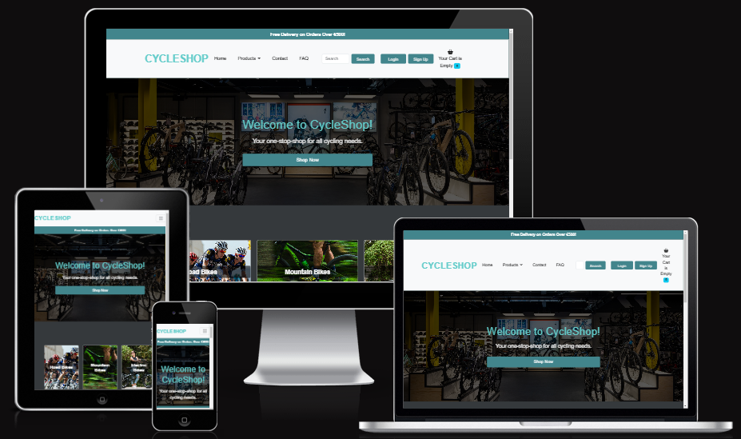

# [CYCLESHOP](https://cycleshop-b289044df6ec.herokuapp.com)

## Project Overview
CycleShop is an e-commerce application for cycling products. Built using Django, it integrates Stripe for payments and provides a user-friendly, full-stack solution for managing an online store.

## Am I Responsive?

Here's deployed site: [Am I Responsive](https://ui.dev/amiresponsive?url=https://cycleshop-b289044df6ec.herokuapp.com/)

## Ignore X-Frame Headers for Site Mockups (Django Projects)

1. **Chrome Extension**: Install Igorne X-Frame headers for chrome to bypass this security restrisction temporarily. Then reload the responsive preview page to view site across devices.
2. **Gitpod Solution**: Run project in Gitpod and, once active, navigate to the Ports tab. Make port 8000 public by clicking the padlock icon, then use the live preview URL in the responsive tool for an accurate preview.

# Setup Instructions

## Set up Environment Variables

- Create an env.py file (touch env.py) in the project root with the following contents:

import os

- #Secret Key
os.environ['SECRET_KEY'] = 'Put secret Key here'

- #Database URL
os.environ['DATABASE_URL'] = 'Put Postgres Key here'

- #Email
os.environ['EMAIL_USER'] = 'Put email address here'
os.environ['EMAIL_PASSWORD'] = 'Put email password here'

- #Stripe Keys
os.environ['STRIPE_PUBLIC_KEY'] = 'Put Public Key here'
os.environ['STRIPE_SECRET_KEY'] = 'Put Secret Key here'

### Run Migrations:

Run the following command to set up the database:

- python manage.py migrate

### Create a Superuser:

To access the Django admin panel, create a superuser:

- python manage.py createsuperuser

### Run the Application:

Start the server with

- python manage.py runserver

# Color scheme

The CycleShop project employs a balanced and professional color scheme to reflect the brand's identity while ensuring accessibility and user-friendliness across all pages. The color choices aim to create a modern and inviting look, enhancing readability and aesthetic appeal.

| **Color Name** | **Hex Code** | **Usage** | **Color** |
| --- | --- | --- | --- |
| Dark Teal | #397367 | Primary color for buttons, links, and headers |  |
| Light Aqua | #63CCCA | Accent color for interactive elements like hover effects |  |
| Muted Green | #5DA399 | Background hightlights and icons |  |
| Steel Blue | #42858C | Subtle color accents for secondary buttons and cards |  |
| Charcoal | #35393C | Used for body text, footer, and darker backgrounds |  |

# User Experience (UX)

The CycleShop project is designed to offer a streamlined and engaging user experience, focused on accessibility, simplicity, and ease of navigation.

1. ## User Stories and Goals
- **Visitors** can browse products, view details, and contact support with ease.
- **Registered Users** can save their preferences, view order history, and manage account details.
- **Site Administrators** can manage products, monitor user activity, and keep content current.

2. ## Navigation and Layout
- **Intuitive Navigation**: The navbar includes clear links to all major pages: Home, Products, Categories, Contact, and FAQ with a search function for specific product lookup.
- **Responsive Design**: A mobile layout ensures easy nagigation and functionality across all devices.
- **Accessible Interaction**: Large, clickable buttons and straightforward form fields create a friendly and accessible interface.

3. ## Home Page
- **Category Accessibility**: Each primary product category (Road Bikes, Mountain Bikes, Electric Bikes, Kids Bikes, Clothing, and Accessories) is displayed in distinct, clickable category cards. This structure allows users to easily explore the range of products available.
- **Responsive Layout**: The use of a responsive, grid-based layout ensures that the pages is easily viewable across devices, enhancing accessibility for all users.
- **Clear Visual Feedback**: Hover effects on category cards provide users with a visual response, indicating interactivity and enhancing the nagigation experience.
- **Efficient Use of Space**: The centered, grid-based layout keeps the design clean, placing emphasis on the category links without overwhelming the user.

4. ## Visual Design and Branding
- **Clean Aesthetic**: Cycleshop uses a professional color palette and modern typography for a polished, high-end look.
- **Product Centric**: High-quality images and clearly displayed product details enhance the shopping experience, creating an engaging visual flow.

5. ## Checkout Process
- **Streamlined Checkout**: Users can easily add, remove, or adjust quantities in their cart, with a simple and secure checkout by stripe integration for reliable payment processing.

6. ## Alert Messages
- **Real-Time Feedback**: Users receive instant alert messages for various actions, like adding or removing items from their cart, logging in or out, and successful payments.
- **Error Notifications**: If an error occurs during checkout or account management, users see a clear message guiding them on corrective actions.
- **Confirmation Messages**: Upon completing actions like subscribing to the newsletter, registering an account, or placing an order, users see confirmation alerts, helping to reassure them their actions were successful.

7. ## Footer
- **The footer serves as and essential guide**, offering users access to account management, customer services links, and company information. The **My Account** and **Customer Services** sections support quick navigation to key pages like **login**, **Wishlist**, **Contact Us**, and **FAQ**.
- User can subscribe to the CycleShop newsletter directly from the footer, enhancing engagement with on going updates and promotions.

# Features

## Current Features:

**Product Listing**: Users can view a list of products, including product names, descriptions, prices, and stock availability.

**Product Details**: Users can click on individual products to view more detailed information.

**Admin Panel**: Site administrators can add, edit, and delete products from the catalog using Django's admin interface.

**Responsive Design**: The site is fully responsive, built using Bootstrap for an optimal experience on all devices.

**Product Categories**: Products are categorized into Road Bikes, Mountain Bikes, Electric Bikes, Kids Bikes, Clothing, and Accessories.

**Shopping Cart**: Add items to a cart (toast notification) and track them throughout the session.

**User Authentication**: Users can register, log in, and manage their accounts.

**Search Functionality**: Users can search for products using the search bar.

**Wishlist**: Users can save items to their wishlist for future purchase consideration.

**Responsive Design**: Fully responsive layout using Bootstrap.

**Free Delivery Banner**: Offers free delivery for orders over €500.

**Newsletter Subscription**: Users can subscribe to the newsletter.

## Technologies Used

- **Frontend**: 
  - HTML, CSS (Bootstrap 5)
  - JavaScript

- **Backend**:
  - Django 5.1.1 (Python)
  - SQLite (Development)
  - PostgresSQL
  - Django AllAuth (User Authentication)
  - Django Forms for handing user inputs

- **Database**: 
  - SQLite for development
  - PostgresSQL

  **Payment Gateway**: Stripe API

## Setup Instructions

## Credits

Accordian - https://djangosnippets.org/snippets/10658/

Wishlist - https://pythongeeks.org/python-django-wishlist-project/

Perplexity - https://perplexity.ai

