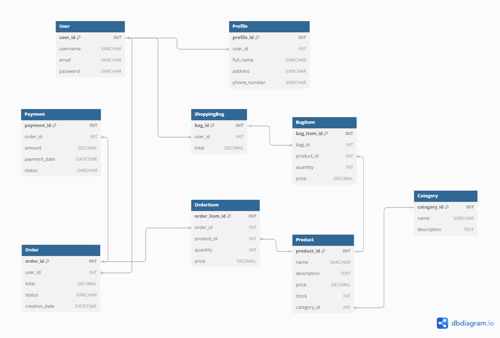

# [CYCLESHOP](https://cycleshop-b289044df6ec.herokuapp.com)

## Project Overview
CycleShop is an e-commerce application for cycling products. Built using Django, it integrates Stripe for payments and provides a user-friendly, full-stack solution for managing an online store.

## Am I Responsive?

Here's deployed site: [Am I Responsive](https://ui.dev/amiresponsive?url=https://cycleshop-b289044df6ec.herokuapp.com/)

## Ignore X-Frame Headers for Site Mockups (Django Projects)

1. **Chrome Extension**: Install Igorne X-Frame headers for chrome to bypass this security restrisction temporarily. Then reload the responsive preview page to view site across devices.
2. **Gitpod Solution**: Run project in Gitpod and, once active, navigate to the Ports tab. Make port 8000 public by clicking the padlock icon, then use the live preview URL in the responsive tool for an accurate preview.

# Setup Instructions

## Set up Environment Variables

- Create an env.py file (touch env.py) in the project root with the following contents:

import os

- #Secret Key
os.environ['SECRET_KEY'] = 'Put secret Key here'

- #Database URL
os.environ['DATABASE_URL'] = 'Put Postgres Key here'

- #Email
os.environ['EMAIL_USER'] = 'Put email address here'
os.environ['EMAIL_PASSWORD'] = 'Put email password here'

- #Stripe Keys
os.environ['STRIPE_PUBLIC_KEY'] = 'Put Public Key here'
os.environ['STRIPE_SECRET_KEY'] = 'Put Secret Key here'

### Run Migrations:

Run the following command to set up the database:

- python manage.py migrate

### Create a Superuser:

To access the Django admin panel, create a superuser:

- python manage.py createsuperuser

### Run the Application:

Start the server with

- python manage.py runserver

The live deployed application can be found on [Heroku](https://cycleshop-b289044df6ec.herokuapp.com).

# PostgreSQL Database
- This project uses a [Code Institute PostgreSQL Database](https://dbs.ci-dbs.net/) for reliable and efficient data storage.

**Steps to Obtain and Set Up the Database**:

- Signed in to the CI LMS (Learning Management System) using my email address.
- Received an email from Code Institute with the connection details for my PostgreSQL Database.
- Configured the database URL in my project’s environment variables to establish a secure connection between the application and the database.

# Color scheme

The CycleShop project employs a balanced and professional color scheme to reflect the brand's identity while ensuring accessibility and user-friendliness across all pages. The color choices aim to create a modern and inviting look, enhancing readability and aesthetic appeal.

I used [coolors.co](https://coolors.co/) to generate my color palette.

| **Color Name** | **Hex Code** | **Usage** | **Color** |
| --- | --- | --- | --- |
| Dark Teal | #397367 | Primary color for buttons, links, and headers |  |
| Light Aqua | #63CCCA | Accent color for interactive elements like hover effects |  |
| Muted Green | #5DA399 | Background hightlights and icons |  |
| Steel Blue | #42858C | Subtle color accents for secondary buttons and cards |  |
| Charcoal | #35393C | Used for body text, footer, and darker backgrounds |  |

# User Experience (UX)

The CycleShop project is designed to offer a streamlined and engaging user experience, focused on accessibility, simplicity, and ease of navigation.

1. ## User Stories and Goals
- **Visitors** can browse products, view details, and contact support with ease.
- **Registered Users** can save their preferences, view order history, and manage account details.
- **Site Administrators** can manage products, monitor user activity, and keep content current.

2. ## Navigation and Layout
- **Intuitive Navigation**: The navbar includes clear links to all major pages: Home, Products, Categories, Contact, and FAQ with a search function for specific product lookup.
- **Responsive Design**: A mobile layout ensures easy nagigation and functionality across all devices.
- **Accessible Interaction**: Large, clickable buttons and straightforward form fields create a friendly and accessible interface.

3. ## Home Page
- **Category Accessibility**: Each primary product category (Road Bikes, Mountain Bikes, Electric Bikes, Kids Bikes, Clothing, and Accessories) is displayed in distinct, clickable category cards. This structure allows users to easily explore the range of products available.
- **Responsive Layout**: The use of a responsive, grid-based layout ensures that the pages is easily viewable across devices, enhancing accessibility for all users.
- **Clear Visual Feedback**: Hover effects on category cards provide users with a visual response, indicating interactivity and enhancing the nagigation experience.
- **Efficient Use of Space**: The centered, grid-based layout keeps the design clean, placing emphasis on the category links without overwhelming the user.

4. ## Visual Design and Branding
- **Clean Aesthetic**: Cycleshop uses a professional color palette and modern typography for a polished, high-end look.
- **Product Centric**: High-quality images and clearly displayed product details enhance the shopping experience, creating an engaging visual flow.

5. ## Checkout Process
- **Streamlined Checkout**: Users can easily add, remove, or adjust quantities in their cart, with a simple and secure checkout by stripe integration for reliable payment processing.

6. ## Alert Messages
- **Real-Time Feedback**: Users receive instant alert messages for various actions, like adding or removing items from their cart, logging in or out, and successful payments.
- **Error Notifications**: If an error occurs during checkout or account management, users see a clear message guiding them on corrective actions.
- **Confirmation Messages**: Upon completing actions like subscribing to the newsletter, registering an account, or placing an order, users see confirmation alerts, helping to reassure them their actions were successful.

7. ## Footer
- **The footer serves as and essential guide**, offering users access to account management, customer services links, and company information. The **My Account** and **Customer Services** sections support quick navigation to key pages like **login**, **Wishlist**, **Contact Us**, and **FAQ**.
- User can subscribe to the CycleShop newsletter directly from the footer, enhancing engagement with on going updates and promotions.

# Features

## Current Features:

- **Product Listing**: Users can view a list of products, including product names, descriptions, prices, and stock availability.

- **Product Details**: Users can click on individual products to view more detailed information.

- **Admin Panel**: Site administrators can add, edit, and delete products from the catalog using Django's admin interface.

- **Responsive Design**: The site is fully responsive, built using Bootstrap for an optimal experience on all devices.

- **Product Categories**: Products are categorized into Road Bikes, Mountain Bikes, Electric Bikes, Kids Bikes, Clothing, and Accessories.

- **Shopping Cart**: Add items to a cart and track them throughout the session.

- **User Authentication**: Users can register, log in, and manage their accounts.

- **Search Functionality**: Users can search for products using the search bar.

- **Wishlist**: Users can save items to their wishlist for future purchase consideration.

- **Responsive Design**: Fully responsive layout using Bootstrap.

- **Free Delivery Banner**: Offers free delivery for orders over €500.

- **Newsletter Subscription**: Users can subscribe to the newsletter.

# Miscellaneous

1. **Automated Alert Messages**:
- Integrated alert messages for actions like adding to cart, updating quantity, and deleting items. This improves the UX by confirming users actions in real-time.

2. **Footer with Essential Link**:
- The footer includes links for quick access to important sections like account management, customer service, and newsletter subscription. It provides easy navigation and enhances user engagement.

3. **Image Optimization for Faster Loading**:
- All images are optimized to ensure faster loading times, which contributes to a smoother user experience, particularly on mobile.

4. **SEO Optimization**:
- Basic SEO practices are implemented, such as meta tags and alt text for images, to improve the site's discoverability on search engines.

5. **Google Analytics Integration**:
- 

6. **Cross-Browser Compatibility**:
- Tested across major browsers (Chrome, Firefox, Safari) to ensure consistent performance and visual experience.

7. **Accessibility Features**:
- Designed with accessibility in mind, including ARIA labels and color contrasts that comply with WCAG standards, ensuring that CycleShop is accessible to all users.

# Typography

The CycleShop project leverages clean and modern fonts to enhance readability and provide a professional aesthetic. Consistent typography helps reinforce the brand identity across the application.

## Fonts Used

1. **Primary Font** - Roboto
- *Roboto* is used across most of the text elements in the application, including body text and headings, to provide a clear and modern look.
- Style: Sans-serif
- Use: General text, paragraphs, and form inputs.
- Reasoning: *Roboto* is chosen for its reaadability and clean design, making it suitable for both mobile and desktop screens.

2. **Secondary Font** - Oswald
- *Oswald* is used for specific headings, titles, and highlighted text.
- Style: Sans-serif
- Use: Key headers and section titles.
- Reasoning: *Oswald* adds contrast to the primary font, creating a more dynamic hierarchy for importment text.

## Icon Library
- **Font Awesome** icons are used across the application for user interface elements like shopping cart, user profile, search, and social media links.
- Use: Provides universally recognized icons that enhance usability and provide visual guidance to users.
- Reasoning: Using icons from Font Awesome simplifies navigation and adds a polished look to the interface.

# User Stories

### Development Plan: MoSCoW Prioritization and Agile Methodology
In this project, I implemented an Agile approach combined with MoSCoW prioritization to ensure an organized, user-centered development process. This approach allowed me to focus on delivering essential features first, followed by desirable enhancements, while maintaining flexibility for future improvements.

Using **MoSCoW prioritization** within my GitHub Kanban board, I categorized each user story into four levels:

- **Must Have:** Core features necessary for the project’s functionality, such as product browsing, shopping cart management, and secure checkout.
- **Should Have:** Important but non-essential features like search filtering, wishlist functionality, and newsletter subscription.
- **Could Have:** Features that enhance the user experience, such as order history and promotional banners.
- **Won’t Have:** Additional features that, while valuable, are not prioritized for the current scope.

This Agile setup with MoSCoW in my Kanban board allowed me to track progress, iterate effectively, and remain adaptable to feedback. By managing development in this way, I focused on delivering a minimum viable product (MVP) quickly, then gradually expanding functionality to enrich the user experience without compromising on quality or project timelines.

## As a User

### Homepage Experience

- As a User, I want to easily access and navigate the homepage so that I can see clear and well-organized sections of the site.

### Product Browsing and Details

- As a User, I want to view all available products so that I can browse through the items offered in each category.
- As a User, I want to view the details of a product so that I can make an informed decision before purchasing.

### User Account and Authentication

- As a User, I want to register for an account so that I can save my shipping details for future purchases.
- As a Registered User, I want to log in so that I can access my previous orders and saved preferences.
- As a Registered User, I want to reset my password so that I can regain access to my account if I forget it.

### Shopping Cart and Checkout

- As a User, I want to add products to my shopping cart so that I can purchase multiple items at once.
- As a User, I want to remove items from my cart so that I can modify my order before checkout.
- As a User, I want to update the quantity of items in my cart so that I can adjust my order.
- As a User, I want to securely check out and make a payment so that I can complete my purchase.

### Search and Filtering

- As a User, I want to search for products by category or keyword so that I can easily find the items I need.
- As a User, I want to filter products by price or availability so that I can narrow down my choices.

### Post-Purchase Communication

- As a User, I want to receive a confirmation email after a successful purchase so that I know my order was processed.

### Wishlist and Notifications

- As a User, I want to save items to a wishlist so that I can purchase them at a later date.
- As a User, I want to subscribe to the newsletter so that I can receive updates about new products and promotions.
- As a Site Administrator

### Product Management

- As a Site Administrator, I want to add new products so that I can keep my product catalog up to date.
- As a Site Administrator, I want to edit product details so that I can correct mistakes or update pricing.
- As a Site Administrator, I want to delete products from the catalog so that I can remove discontinued items.

### Customer Interaction

- As a Site Administrator, I want to moderate customer reviews so that I can maintain the quality of feedback on my site.
- As a Site Administrator, I want to manage user accounts so that I can handle customer service issues efficiently.

### GitHub Issues

[GitHub Issues](https://github.com/trxdave/cycleshop/issues) served as an additional Agile tool for effective project management. Using my custom User Story Template, I documented and managed user stories efficiently. This approach enabled structured and clear tracking of user requirements, bug fixes, and feature requests.

Furthermore, GitHub Issues facilitated the iterative development process by aligning user stories with specific milestones. I used weekly iterations to track progress and adjust the project roadmap accordingly.

- Open Issues

- Closed Issues

# Ecommerce Business Model
This site operates under a Business to Customer (B2C) model, where it sells cycling goods directly to individual customers. The focus is on straightforward individual transactions, without the need for subscription-based models such as monthly or annual plans.

Despite being in the early stages of development, the site already includes features such as a newsletter and links for social media marketing. These tools lay the groundwork for growing the business's online presence and fostering customer engagement.

- **Social Media Marketing**: Leveraging large platforms like Facebook can help build a community around the business, increase brand awareness, and drive traffic to the site.
- **Newsletter**: The email subscription feature allows the business to share regular updates with users, such as special offers, new product launches, changes to business hours, event notifications, and more.

# Newsletter Marketing
I have implemented a custom newsletter sign-up feature within my Django application. This allows users to provide their email addresses to receive updates about new products, offers, and other announcements.

## **Implementation Details**

**Custom Newsletter Model**:

- I created a NewsletterSubscriber model to store the email addresses of users who wish to receive newsletters.

**Subscription View**:
- The subscribe_newsletter view handles both new subscriptions and cases where an email is already subscribed.
- Users are provided with appropriate feedback through messages, ensuring a user-friendly experience.

**Code Snippet**
- Below is the view code that handles newsletter subscriptions:

## **How It Works**

- **Subscription Check**: The code checks if the provided email is already subscribed to avoid duplicate entries.

- **User Feedback**: Users are shown success or informational messages using Django's messaging framework.

- **Redirection**: Successful subscriptions are followed by a redirect to a confirmation page, while repeated subscriptions or invalid requests redirect users to the home page.

# Wireframes

- Wireframes were created to visualize the layout and design of the CycleShop.

## Desktop Wireframes

| **Page** | **Wireframes** | **Pass** |
| --- | --- | :---: |
| Home | 

Screenshot of result

| :white_check_mark:|
| Product | 

Screenshot of result

| :white_check_mark:|
| Contact | 

Screenshot of result

| :white_check_mark:|
| FAQ | 

Screenshot of result

| :white_check_mark:|
| Login | 

Screenshot of result

| :white_check_mark:|
| Register | 

Screenshot of result

| :white_check_mark:|
| My Orders | 

Screenshot of result

| :white_check_mark:|
| Wishlist | 

Screenshot of result

| :white_check_mark:|
| Shipping Information | 

Screenshot of result

| :white_check_mark:|
| Return & Exchanges | 

Screenshot of result

| :white_check_mark:|
| Road Bikes | 

Screenshot of result

| :white_check_mark:|
| Mountain Bikes | 

Screenshot of result

| :white_check_mark:|
| Electric Bikes | 

Screenshot of result

| :white_check_mark:|
| Kids Bikes | 

Screenshot of result

| :white_check_mark:|
| Clothing | 

Screenshot of result

| :white_check_mark:|
| Accessories | 

Screenshot of result

| :white_check_mark:|
| Your Shopping Bag | 

Screenshot of result

| :white_check_mark:|
| Road Bikes | 

Screenshot of result

| :white_check_mark:|

## Mobile Wireframes

| **Page** | **Wireframes** | **Pass** |
| --- | --- | :---: |
| Home | 

Screenshot of result

| :white_check_mark:|
| Product | 

Screenshot of result

| :white_check_mark:|
| Contact | 

Screenshot of result

| :white_check_mark:|
| FAQ | 

Screenshot of result

| :white_check_mark:|
| Login | 

Screenshot of result

| :white_check_mark:|
| Register | 

Screenshot of result

| :white_check_mark:|
| My Orders | 

Screenshot of result

| :white_check_mark:|
| Wishlist | 

Screenshot of result

| :white_check_mark:|
| Shipping Information | 

Screenshot of result

| :white_check_mark:|
| Return & Exchanges | 

Screenshot of result

| :white_check_mark:|
| Road Bikes | 

Screenshot of result

| :white_check_mark:|
| Mountain Bikes | 

Screenshot of result

| :white_check_mark:|
| Electric Bikes | 

Screenshot of result

| :white_check_mark:|
| Kids Bikes | 

Screenshot of result

| :white_check_mark:|
| Clothing | 

Screenshot of result

| :white_check_mark:|
| Accessories | 

Screenshot of result

| :white_check_mark:|
| Your Shopping Bag | 

Screenshot of result

| :white_check_mark:|
| Road Bikes | 

Screenshot of result

| :white_check_mark:|

# Future Features

1. User-Generated Reviews and Ratings:
- Allow users to leave reviews and rate products, providing valuable feedback for other customers.

2. Product Recommendations:
- Implement a recommendation engine that suggests products based on browsing history or purchase history to enhance the shopping experience.

3. Enhanced Order Tracking:
- Provide users with real-time order tracking to follow their purchases from confirmation to delivery.

4. Discount Codes and Promotions:
- Add a feature to apply discount codes or run promotional events to boost sales and improve customer retention.

5. Admin Analytics Dashboard:
- Include a dashboard for site administrators to monitor sales metrics, user activity, and popular products.

6. Multi-Language Support:
- Extend the app to support multiple languages for a more inclusive, global user experience.

7. Blog Section:
- Add a blog for sharing cycling tips, maintenance guides, and news related to biking to boost site engagement.

8. Saved Payment Methods:
- Allow registered users to save preferred payment methods to streamline future checkouts.

9. AI Chatbot for Customer Support:
- Integrate an AI chatbot to assist users with common questions and site navigation.

10. Detailed Product Specifications:
- Include sections for product specifications such as weight, material, and size to give users more comprehensive information for their purchase decisions.

11. Unsubcribe Feature for Newsletter:
- Allow users to easily unsubscribe from the newsletter, providing a more flexible and user-friendly experience.

12. Enhanced Filter Options:
- Add filtering by specifications like weight, material, and size to help users narrow down options effectively.

13. Product Comparision:
- Enable a comparision feature for users to view multiple products side-by-side, focusing on details like weight, material, and size.

14. Customized Product Recommendations:
- Leverage specifications like material and size to make more personalized recommendations based on user preferences.

# Entity-Relationship Diagram (ERD)

- **User and Profile**: A one-to-one relationship where each user has an associated profile, storing additional details.
- **Profile and Wishlist**: The Profile table has an optional one-to-one link to Wishlist.
- **Product and Category**: Products belong to categories, allowing for product classification.
- **Wishlist and Products**: A many-to-many relationship through the WishlistProducts table, allowing users to add multiple products to their wishlist.
- **Order and BagItem**: An order can contain multiple BagItems, with each item linked to a specific product and quantity.

# Technologies Used

In this section, I outline the various tools and technologies that were essential in the development of CycleShop. Each technology played a specific role, from enabling efficient back-end development to ensuring an intuitive and responsive user interface.

- **Python**: [Python](https://www.python.org/) is the core programming language used for building the back-end functionality in Django, handling business logic, and managing data.
- **Django**: [Django](https://www.djangoproject.com/) is a high-level Python web framework used to build the entire CycleShop application, offering features such as ORM, authentication, and admin interfaces.
- **HTML5**: [HTML5](https://developer.mozilla.org/en-US/docs/Glossary/HTML5) forms the backbone of the front-end, defining the structure and layout of the web pages.
- **CSS3**: [CSS3](https://developer.mozilla.org/en-US/docs/Web/CSS) is used to style the HTML elements, providing an aesthetically pleasing and responsive design.
- **Bootstrap 5**: [Bootstrap](https://getbootstrap.com/) is a CSS framework used for responsive design, helping with layout and component styling.
- **JavaScript**: [JavaScript](https://developer.mozilla.org/en-US/docs/Web/JavaScript) is used to add interactivity to the front-end, especially for search features and form validation.
- **jQuery**: [jQuery](https://jquery.com/) is used for DOM manipulation, simplifying JavaScript code.
- **Font Awesome**: [Font Awesome](https://fontawesome.com/) is used for iconography, adding icons to buttons, links, and other elements throughout the site.
- **Google Fonts**: [Google Fonts](https://fonts.google.com/) is used to import fonts, enhancing the website’s typography.
- **PostgreSQL**: [PostgreSQL](https://dbs.ci-dbs.net/) is the database used in production to store and manage data efficiently.
- **SQLite**: [SQLite](https://www.sqlite.org/) is used for local development, as it is easy to set up and configure with Django.
- **Stripe API**: [Stripe](https://stripe.com/ie) is used to handle secure payment processing.
- **Git**: [Git](https://git-scm.com/) is a version control system used to track changes and manage project history.
- **GitHub**: [GitHub](https://github.com/) is used to host the project repository and for version control collaboration.
- **GitPod**: [GitPod](https://www.gitpod.io/) is used as an online IDE for developing and testing the project efficiently.
- **AWS S3**: [Amazon S3](https://aws.amazon.com/s3/) is used for media storage, handling image uploads for products and other assets.
- **Lucidchart**: [Lucidchart](https://www.lucidchart.com/pages)is used to design and visualize the database schema.
- **Am I Responsive**: [Am I Responsive](https://ui.dev/amiresponsive) is used to test and showcase how the website looks on different devices.

# Credits

- Accordian - https://djangosnippets.org/snippets/10658/

- Wishlist - https://pythongeeks.org/python-django-wishlist-project/

- Perplexity - https://perplexity.ai

